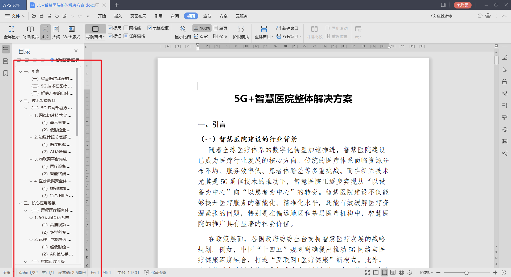
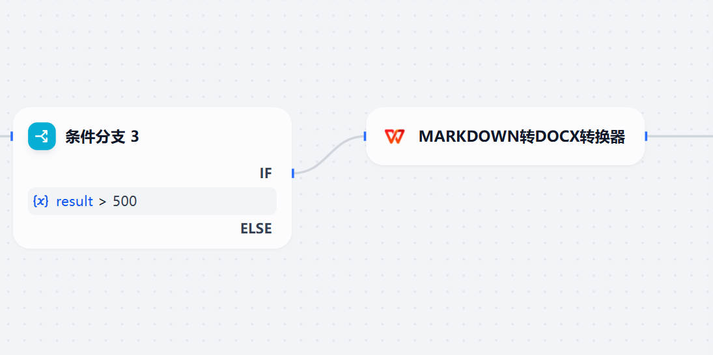

# Markdown to DOCX Converter

**Author:** [yuos](https://github.com/yuos-bit)

**Version:** 0.0.4

**Type:** tool

**Repository:** https://github.com/yuos-bit/DOC-Dify-Plugin

---
- 该插件在 [Steven Lynn DOC-Dify-Plugin](https://github.com/stvlynn/DOC-Dify-Plugin)基础上进行中文适配修改
- 该插件允许您直接在 Dify 中轻松地将 Markdown 内容转换为 Word DOCX 文档,目前已兼容wps、office
- 测试版本wps2019专业版、office2014 LTSC专业版
- 本地打包测试：[打包教程](./README-Zh-cn.md) 
## 转化的word格式
- 标题：方正小标宋_GBK，二号。
- 正文：仿宋GB_2312,三号。
- 层次结构：
- 一级：，黑体；
- 二级：，楷体；
- 三级: ，仿宋GB_2312；
- 四级：，仿宋GB_2312。
- 附件：正文下空一行，首行缩进2个字符，如有多个附件，用阿拉伯数字标注“1.”第二行与第一行附件正文文字对齐。

成品展示：

## Setup

### Installation

1. 从 [Dify Marketplace](https://marketplace.dify.ai/plugins/stvlynn/doc) 安装插件
2. 导航到 Dify 工作区中的“插件”部分
3. 找到“Markdown to DOCX”插件并点击“安装”
4. 安装完成后，您可以在应用程序中使用该插件

### Adding to Applications

1. 创建或编辑 Chatflow 或 Workflow 应用程序
2. 在工具选择面板中，选择“DOC”工具
3. 根据需要在应用程序流程中配置该工具
4. 保存并发布您的应用程序

## Usage

您可以使用此工具将 Markdown 内容转换为 DOCX 格式，并传入以下两个参数：

- **markdown_content**（必填）：您要转换的 Markdown 内容

- **title**（可选）：文档标题（默认为“Document”）

原始:

修改版：

## Feedback and Issues

如果您遇到任何问题或有改进建议：

1. 请在[插件的 GitHub 仓库](https://github.com/yuos-bit/DOC-Dify-Plugin/issues)中提交问题

2. 提供问题详情，包括错误消息和重现步骤

3. **请勿**将插件相关的问题提交到主 [Dify](https://github.com/langgenius/dify) 仓库

## License

[MIT](./LICENSE)