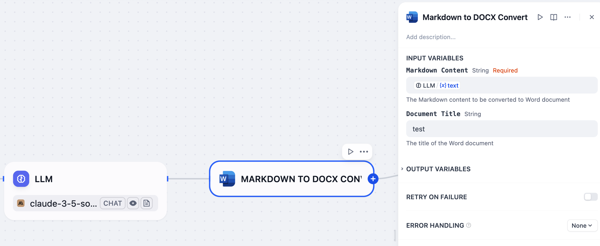

# Markdown to DOCX Converter

**Author:** [Steven Lynn](https://github.com/stvlynn)

**Version:** 0.0.3

**Type:** tool

**Repository:** https://github.com/stvlynn/DOC-Dify-Plugin

---

This plugin allows you to easily convert Markdown content to Microsoft Word DOCX documents directly within Dify.

## Setup

### Installation

1. Install the plugin from [Dify Marketplace](https://marketplace.dify.ai/plugins/stvlynn/doc)
2. Navigate to **Plugins** section in your Dify workspace
3. Find the "Markdown to DOCX" plugin and click "Install"
4. Once installed, you can use the plugin in your applications

### Adding to Applications

1. Create or edit a Chatflow or Workflow application
2. In the tool selection panel, select "DOC" tool
3. Configure the tool in your application flow as needed
4. Save and publish your application

## Usage

You can use this tool to convert Markdown content to DOCX format with two parameters:

- **markdown_content** (required): The Markdown content you want to convert

- **title** (optional): The title for the document (defaults to "Document")

## Feedback and Issues

If you encounter any problems or have suggestions for improvements:

1. Please open an issue in the [plugin's GitHub repository](https://github.com/stvlynn/DOC-Dify-Plugin/issues)

2. Provide details about your problem, including error messages and steps to reproduce

3. **Do not** submit issues to the main [Dify](https://github.com/langgenius/dify) repository for plugin-specific problems

## License

[MIT](./LICENSE)

